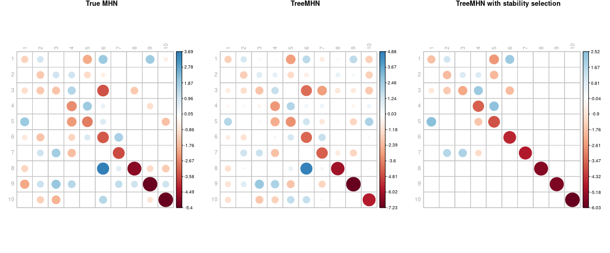
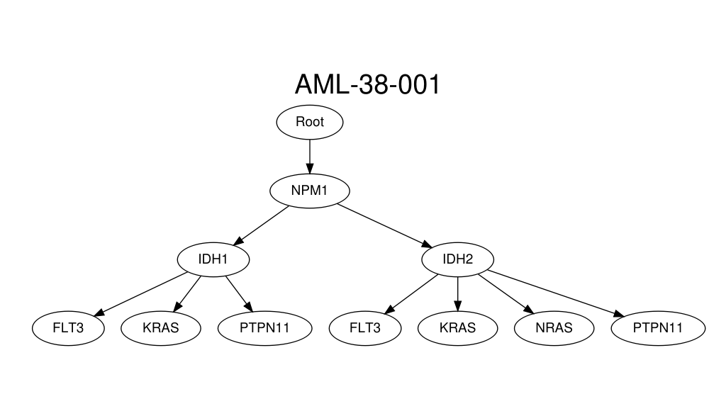
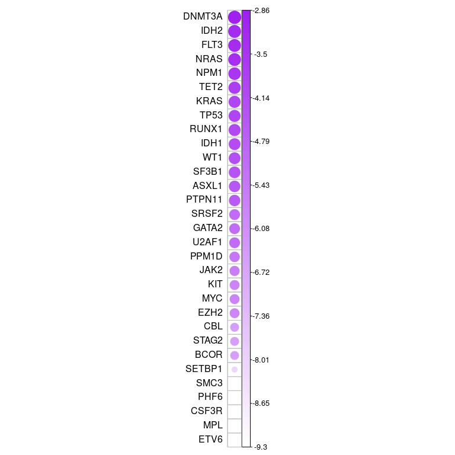
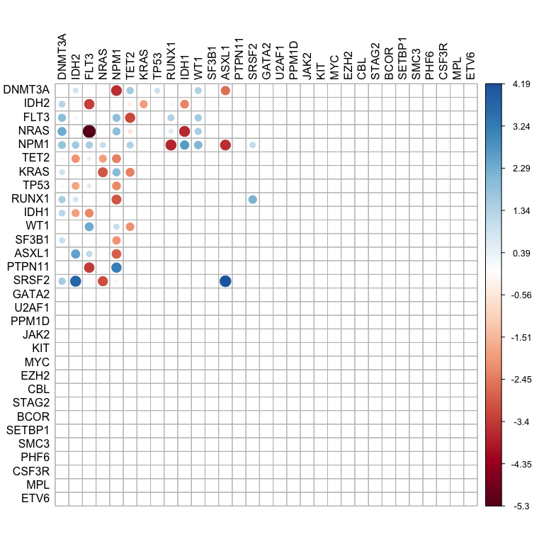
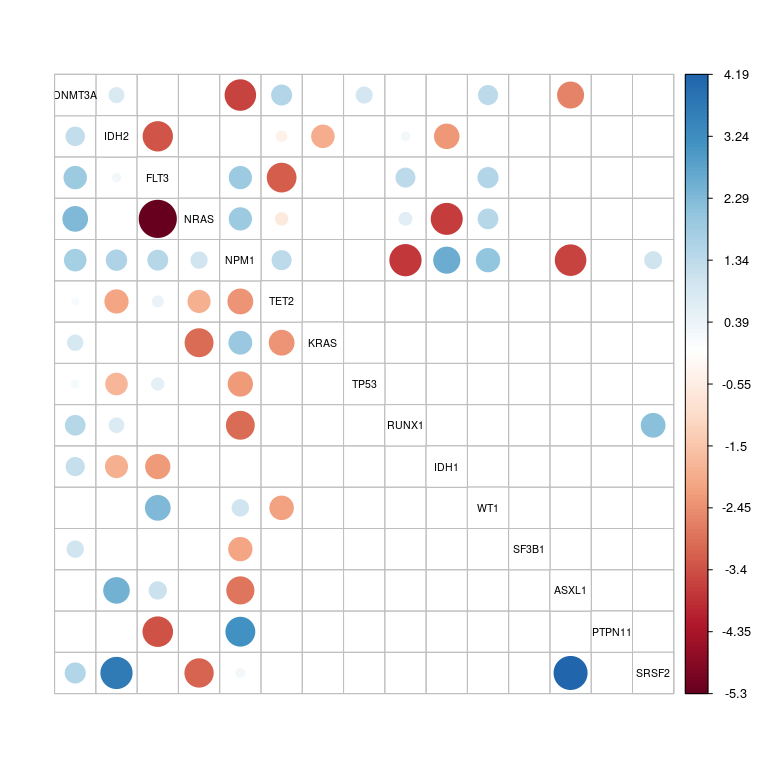
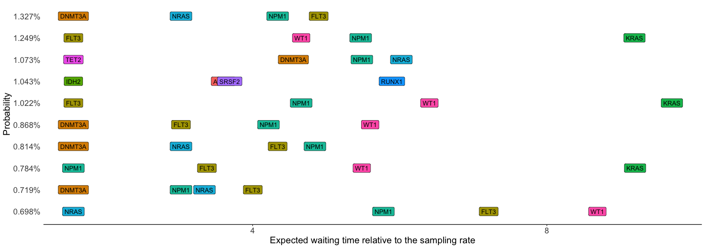
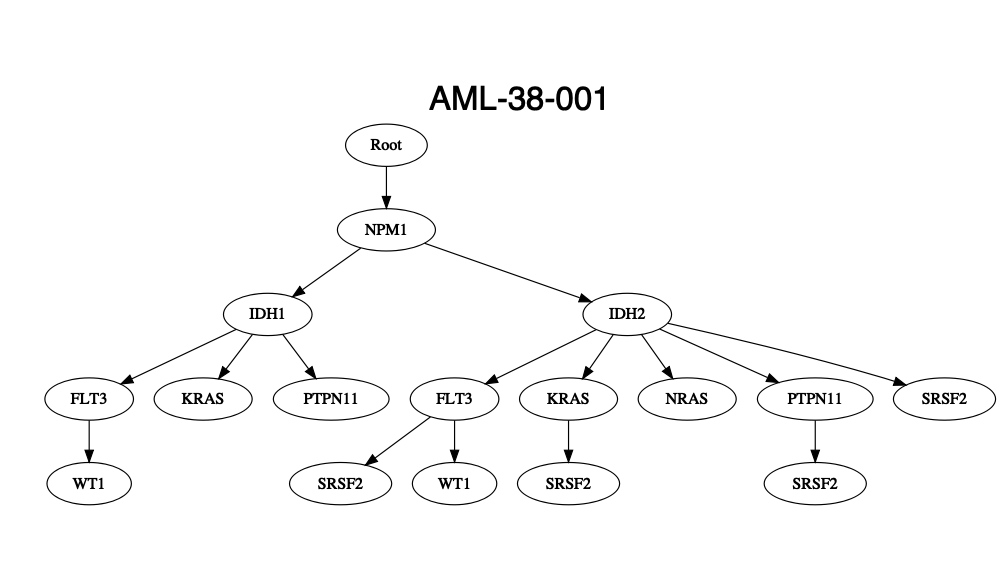

This document demonstrates how to use the `TreeMHN` package. The package
is created based on the article “Joint inference of repeated
evolutionary trajectories and patterns of clonal exclusivity or
co-occurrence from tumor mutation trees”.

1 Load required packages
========================

``` r
library(TreeMHN)
library(corrplot)
library(parallel)
library(Matrix)
library(DiagrammeR)
library(ggplot2)
library(dplyr)
```

2 Simulated data
================

2.1 Generate trees
------------------

The function `generate_trees` can generate a random Mutual Hazard
Network *Θ* and a set of mutation trees from *Θ* according to the tree
generating process introduced in the paper.

``` r
set.seed(777)
n <- 10 # number of events
N <- 500 # number of samples
lambda_s <- 1 # sampling event rate
gamma <- 0.1 # penalty parameter
sparsity <- 0.5 # sparsity of the MHN
exclusive_ratio <- 0.5 # proportion of inhibiting edges

# This function will generate a random MHN along with a collection of mutation trees
tree_obj <- generate_trees(n = n, N = N, lambda_s = lambda_s, sparsity = sparsity, 
                           exclusive_ratio = exclusive_ratio)
true_Theta <- tree_obj$Theta # true MHN
trees <- tree_obj$trees # extract trees
```

We can plot one of the trees using the `plot_tree` function:

``` r
tree <- trees[[77]]
plot_tree(tree, tree_obj$mutations)
```


2.2 Learn MHN from the generated trees
--------------------------------------

The function `learn_MHN` takes a `TreeMHN` object and learns an MHN *Θ̂*.

-   Without stability selection:

``` r
pred_Theta <- learn_MHN(tree_obj, gamma = gamma, lambda_s = lambda_s, verbose = TRUE)
```

    ## Initializing Theta...
    ## Checking whether MCEM is needed...
    ## Running MLE...
    ## iter   10 value 3202.165826
    ## iter   20 value 3169.624652
    ## iter   30 value 3164.886140
    ## iter   40 value 3163.296204
    ## iter   50 value 3162.429880
    ## iter   60 value 3162.120673
    ## final  value 3162.032487 
    ## converged

-   With stability selection ([Meinshausen and
    Bühlmann (2010)](https://rss.onlinelibrary.wiley.com/doi/abs/10.1111/j.1467-9868.2010.00740.x)):

``` r
# Function to subsample half of the trees and learn one MHN
subsample_size <- floor(N/2)
subsample_once <- function(subsample_size, tree_obj, gamma) {
  subsample_trees <- sample(tree_obj$trees, subsample_size)
  tree_obj$trees <- subsample_trees
  tree_obj$N <- subsample_size
  pred_Theta <- learn_MHN(tree_obj, gamma)
  return(pred_Theta)
}

# Function to get a vector of non-selected (masked) elements 
get_mask <- function(n, SS_res, thr = 0.95) {
  to_mask <- sapply(SS_res, function (x) as.vector(x))
  to_mask[abs(to_mask) > 1e-3] <- 1
  to_mask[to_mask != 1] <- 0
  to_mask <- which(matrix(apply(to_mask,1,mean) > thr,nrow = n) == 0)
  return(to_mask)
}
```

It is recommended to run the stability selection procedure using the
`parallel` package.

``` r
SS_res <- mclapply(c(1:100), function(i) subsample_once(subsample_size, tree_obj, 2), mc.cores = detectCores())
TreeMHN_to_mask <- get_mask(n, SS_res)
pred_Theta_w_SS <- learn_MHN(tree_obj, gamma = gamma, to_mask = TreeMHN_to_mask)
```

    ## Initializing Theta...
    ## Checking whether MCEM is needed...
    ## Running MLE...

2.3 Performance assessment
--------------------------

We first plot the true MHN and the two estimated MHNs by ordering the
entries based on the true baseline rates. At a regularization level
*γ* = 0.1, most entries at the top left corner are recovered. Without
stability selection, there are many false non-zero entries due to
overfitting, including some very small values at the top left corner.
With stability selection, we see that those entries are removed, along
with some true positive entries at the lower left corner.

``` r
par(mfrow = c(1,3))
col.lim.up <- max(max(true_Theta),max(pred_Theta),max(pred_Theta_w_SS))
col.lim.lo <- min(min(true_Theta),min(pred_Theta),min(pred_Theta_w_SS))
idx <- order(diag(true_Theta),decreasing = TRUE)
corrplot(true_Theta[idx,idx], is.corr = FALSE, title = "True MHN",
         col.lim = c(col.lim.lo,col.lim.up),tl.col = "darkgrey", mar = c(1, 1, 1, 1))
```

    ## Warning in text.default(pos.xlabel[, 1], pos.xlabel[, 2], newcolnames, srt =
    ## tl.srt, : "col.lim" is not a graphical parameter

    ## Warning in text.default(pos.ylabel[, 1], pos.ylabel[, 2], newrownames, col =
    ## tl.col, : "col.lim" is not a graphical parameter

    ## Warning in title(title, ...): "col.lim" is not a graphical parameter

``` r
corrplot(pred_Theta[idx,idx], is.corr = FALSE, title = "TreeMHN",
         col.lim = c(col.lim.lo,col.lim.up),tl.col = "darkgrey", mar = c(1, 1, 1, 1))
```

    ## Warning in text.default(pos.xlabel[, 1], pos.xlabel[, 2], newcolnames, srt =
    ## tl.srt, : "col.lim" is not a graphical parameter

    ## Warning in text.default(pos.ylabel[, 1], pos.ylabel[, 2], newrownames, col =
    ## tl.col, : "col.lim" is not a graphical parameter

    ## Warning in title(title, ...): "col.lim" is not a graphical parameter

``` r
corrplot(pred_Theta_w_SS[idx,idx], is.corr = FALSE, title = "TreeMHN with stability selection",
         col.lim = c(col.lim.lo,col.lim.up),tl.col = "darkgrey", mar = c(1, 1, 1, 1))
```

    ## Warning in text.default(pos.xlabel[, 1], pos.xlabel[, 2], newcolnames, srt =
    ## tl.srt, : "col.lim" is not a graphical parameter

    ## Warning in text.default(pos.ylabel[, 1], pos.ylabel[, 2], newrownames, col =
    ## tl.col, : "col.lim" is not a graphical parameter

    ## Warning in title(title, ...): "col.lim" is not a graphical parameter



We can compute the precision and recall (= true positive rate) based on
the off-diagonal differences using function `compare_Theta`. (See the
Supplementary Material for more details.)

| *Θ* (left) *Θ̂* (top) | *i* *j* | *i* → *j* | *i* ⊣ *j* |
|----------------------|---------|-----------|-----------|
| *i* *j*              | TN      | FP        | FP        |
| *i* → *j*            | FN      | TP        | FP        |
| *i* ⊣ *j*            | FN      | FP        | TP        |

-   Without stability selection:

``` r
compare_Theta(true_Theta, pred_Theta)
```

    ##       SHD        TP        FP        TN        FN Precision       TPR     FPR_N 
    ##     50.00     38.00     47.00      2.00      3.00      0.45      0.84      1.04 
    ##     FPR_P       MSE 
    ##      1.04      0.86

-   With stability selection:

``` r
compare_Theta(true_Theta, pred_Theta_w_SS)
```

    ##       SHD        TP        FP        TN        FN Precision       TPR     FPR_N 
    ##     29.00     16.00      0.00     45.00     29.00      1.00      0.36      0.00 
    ##     FPR_P       MSE 
    ##      0.00      0.73

If we focus on the first half of the events with higher baseline rates,
we can see an increase in recall/TPR.

-   Without stability selection:

``` r
top_idx <- idx[c(1:(n/2))]
compare_Theta(true_Theta[top_idx,top_idx], pred_Theta[top_idx,top_idx])
```

    ##       SHD        TP        FP        TN        FN Precision       TPR     FPR_N 
    ##      9.00     11.00      9.00      0.00      0.00      0.55      1.00      1.00 
    ##     FPR_P       MSE 
    ##      0.82      0.13

-   With stability selection:

``` r
compare_Theta(true_Theta[top_idx,top_idx], pred_Theta_w_SS[top_idx,top_idx])
```

    ##       SHD        TP        FP        TN        FN Precision       TPR     FPR_N 
    ##      0.00     11.00      0.00      9.00      0.00      1.00      1.00      0.00 
    ##     FPR_P       MSE 
    ##      0.00      0.24

3 Real data
===========

3.1 Input dataset
-----------------

Here we use the tree dataset from [Morita et
al. (2020)](https://www.nature.com/articles/s41467-020-19119-8).

``` r
load("AML_tree_obj.RData")
plot_tree(AML$trees[[21]], mutations = AML$mutations, tree_label = "AML-38-001") # note that we summarize the mutations at the gene level
```



To use another dataset, please make sure it is in dataframe format with
four columns:

-   `Tree_ID`: IDs of mutation trees, unique for each patient;

-   `Node_ID`: IDs of each node in the tree, including the root node
    (with ID “1”), unique for each node;

-   `Mutation_ID`: IDs of each mutational event. The root node has a
    mutation ID of “0”, and other mutation IDs can be duplicated in the
    tree to allow for parallel mutations;

-   `Parent_ID`: IDs of the parent node ID. The root node has itself as
    parent (ID “1”).

For example,

``` r
head(AML$tree_df)
```

    ##   Patient_ID Tree_ID Node_ID Mutation_ID Parent_ID
    ## 1          1       1       1           0         1
    ## 2          1       1       2           1         1
    ## 3          1       1       3           2         5
    ## 4          1       1       4           3         5
    ## 5          1       1       5           4         2
    ## 6          1       1       6           5         5

To convert a dataframe to an `TreeMHN` object, use the `input_tree_df`
function. For example,

``` r
# not run
# input_tree_df(n = AML$n, tree_df = AML$tree_df, mutations = AML$mutations, tree_labels = AML$tree_labels)
```

3.2 Learn the MHN
-----------------

To ensure enough precision, we run stability selection with *γ* = 0.05
and a threshold of 99% and obtain a vector of non-selected elements over
1000 subsamples. Again, we recommend to run the code using the
`parallel` package on a cluster.

``` r
# set.seed(123)
RNGkind("L'Ecuyer-CMRG")
gamma <- 0.05
subsample_size <- floor(AML$N / 2)
SS_res <- mclapply(c(1:1000), function(i) subsample_once(subsample_size, AML, gamma), mc.cores = detectCores(), mc.set.seed = TRUE)
to_mask <- get_mask(AML$n, SS_res, 0.99)
```

Then we refit the model with *γ* = 0 by masking the non-selected
elements.

``` r
AML_Theta <- learn_MHN(AML, gamma = gamma, to_mask = to_mask)
```

    ## Initializing Theta...
    ## Checking whether MCEM is needed...
    ## Running MLE...

``` r
save(AML_Theta, file = "AML_Theta.RData")
```

3.3 Plot the network
--------------------

Now we can plot the learned MHN.

``` r
par(mfrow = c(1,1))
dimnames(AML_Theta) <- list(AML$mutations, AML$mutations)
idx <- order(diag(AML_Theta), decreasing = TRUE)
temp <- AML_Theta
diag(temp) <- 0
Theta_diag <- matrix(diag(AML_Theta)[idx], ncol = 1)
rownames(Theta_diag) <- AML$mutations[idx]
colnames(Theta_diag) <- c(" ")
```

The diagonal entries represent the baseline rates of mutations to occur,
independent of other events:

``` r
col1 <- colorRampPalette(c('white', 'purple')) 
corrplot(Theta_diag, is.corr = FALSE, cl.pos = 'r', tl.col = 'black', cl.ratio = 2, cl.offset = 5, col = col1(100))
```



The off-diagonal entries represent the interactions between mutations:

``` r
corrplot(temp[idx,idx], is.corr = FALSE, tl.col = 'black')
```



If we focus on the entries with non-zero off-diagonal entries, we get:

``` r
par(mfrow = c(1,1))
to_show <- sapply(c(1:AML$n), function (i) any(AML_Theta[i,-i] != 0) || any(AML_Theta[-i,i] != 0))
to_show_mat <- AML_Theta[to_show,to_show]
dimnames(to_show_mat) <- list(AML$mutations[to_show],AML$mutations[to_show])
to_show_idx <- order(diag(to_show_mat),decreasing = TRUE)
diag(to_show_mat) <- 0
corrplot(round(to_show_mat[to_show_idx,to_show_idx],2), is.corr = FALSE,
         tl.col = "black",tl.pos = "d",tl.cex = 0.66)
```



Given the estimated MHN, we can plot the most probable evolutionary
trajectories of a given length using the `plot_pathways` function. Here
we choose length 4.

``` r
plot_pathways(AML_Theta, mutations = AML$mutations, n_order = 4, top_M = 10)
```



Given a particular tree and the estimated MHN, we can also find the next
most probable mutational events using the `next_mutation` function.

``` r
next_mutation(AML$n, AML$trees[[21]], AML_Theta, mutations = AML$mutations, tree_label = "AML-38-001", top_M = 6)
```

    ## Top 6 most probable mutational events that will happen next:
    ## The next most probable node: Root->NPM1->IDH2->FLT3->WT1 
    ## Probability: 5.639 %
    ## The next most probable node: Root->NPM1->IDH1->FLT3->WT1 
    ## Probability: 5.531 %
    ## The next most probable node: Root->NPM1->IDH2->SRSF2 
    ## Probability: 4.56 %
    ## The next most probable node: Root->NPM1->IDH2->FLT3->SRSF2 
    ## Probability: 4.56 %
    ## The next most probable node: Root->NPM1->IDH2->KRAS->SRSF2 
    ## Probability: 4.56 %
    ## The next most probable node: Root->NPM1->IDH2->PTPN11->SRSF2 
    ## Probability: 4.56 %


